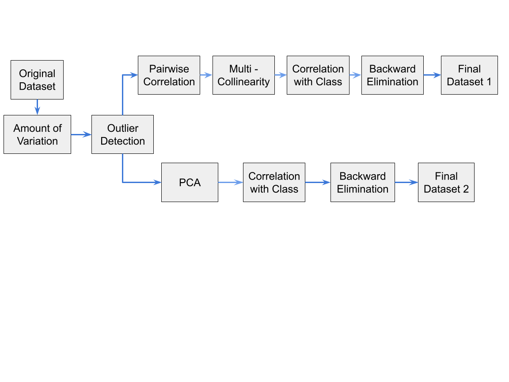

<h1 align="center">Computer Aided Parkinson's Disease Classification</h1>
<h4 align="center">For course fulfillment of Fuse Micro-degree L2</h4>

<h3 align="center"> Jyoti Praksh Uprety &nbsp;&nbsp;•&nbsp;&nbsp; Shailesh Adhikari &nbsp;&nbsp;•&nbsp;&nbsp; Susmita Poudel &nbsp;&nbsp;•&nbsp;&nbsp; Shulav Karki </h3>

---

# Introduction

Parkinson’s disease (PD) is a progressive neurodegenerative disorder characterized by a large number of
motor and non-motor features . PD is the second – after Alzheimer – most common neurodegenerative
disease seen in people over 60 . Recently, many telediagnosis and telemonitoring systems have been proposed which aim 
to detect the disease in its early stage, decrease
the number of inconvenient physical visits to the clinics for clinical examinations, and lessen the workload
of clinicians.

The PD telemedicine systems are based on measuring the severity of the symptoms using non-invasive
devices and tools. One of the most important symptoms seen in approximately 90% of the PD patients in
the earlier stages of the disease is vocal problems. Therefore, vocal disorders-based systems constituted the3
focal point of the recent PD telemedicine studies. In these studies, various speech signal processing
algorithms have been used to extract clinically useful information for PD assessment, and the calculated
features were fed to various learning algorithms to achieve reliable decision support systems.

The results obtained in the PD telemedicine studies showed that the choice of feature extraction and
learning algorithms directly influences the accuracy and reliability of the proposed system. In this study we are
going to test the impact of the choice of feature extraction and learning algorithms on the accuracy and
reliability. We will be using Baseline Vocal Features with machine generated features like, frequency change and
MFCC coefficient.

    <figure>
        
        <figcaption>Figure 1: System Flow for the Project</figcaption>
    </figure>

---

# Methods

## Dataset
The data used in this study were gathered from 188 patients with PD (107 men and 81 women) with ages
ranging from 33 to 87 (65.1±10.9) at the Department of Neurology in Cerrahpaşa Faculty of Medicine,
Istanbul University. The control group consists of 64 healthy individuals (23 men and 41 women) with ages
varying between 41 and 82 (61.1±8.9). During the data collection process, the microphone is set to 44.1
KHz and following the physician’s examination, the sustained phonation of the vowel /a/ was collected
from each subject with three repetitions.

## Feature Extraction

Idiopathic PD is a neurodegenerative disorder which occurs due to loss of neuromelanin-containing
neurons in substantia nigra pars compacta in the midbrain which leads to decrease of striatal dopamine that
 affects speech even at an early stage, and therefore speech features
have been successfully employed to assess PD and monitor its evolution after surgical or pharmacological
treatment. Jitter, shimmer, fundamental frequency parameters, harmonicity parameters, Recurrence Period
Density Entropy (RPDE), Detrended Fluctuation Analysis (DFA) and Pitch Period Entropy (PPE) are the
most popular speech features used in PD studies. These features are referred as **Baseline features** in our study.

Other than these, acoustic analysis software is
utilized for extracting **Time Frequency Features** and **Mel Frequency Cepstral Coefficient**.

By the end of Feature extracting process, we had total of **44** independent features and a dependent class.

## Feature Engineering

For Feature Engineering we are going to perform two different analysis side-by-side.

    <figure>
        
        <figcaption>Figure 2: Feature Engineering Process Flow</figcaption>
    </figure>

For the first analysis, we had used the basic statistical technique to find best features
without any collinearity. We have started with **Variation** anlysis, followed by **Correlation** analysis to remove
any linear relationship between the features.Next, we work with **Multicollinearity** analysis to remove any
collinearity between the features. And, finally we find **Collrelation with Class** analysis to remove any
linear relationship between the features and the class. Finally, we did model based analysis using **Backward Elimanitation**
to produce our first dataset. By the end of this analysis, we have found the **27 independent best features** for our first dataset, i.e 
we have dropped 17 featues from the original dataset.

For second analysis, we have used **PCA** to reduce the dimensionality of the features. We have reduced features in 
such a way, atleast **90% of the variance** is retained. Finally, Finally, we did model based analysis using **Backward Elimanitation**
to produce our second dataset.By the end of this analysis, we have found the **30 independent best features** for our second dataset, i.e
we have dropped 14 featues from the original dataset.

## Experiments with models

After Successful completion of feature engineering, we have trained and tested multiple models on the dataset. We have used the following models:
1. Logistic Regression
2. Ensemble of Decision Trees
3. Random Forest Classifier
4. Support Vector Machine
5. Naive Bayes Classifier
6. XGBoost Classifier

Most of the algorithm were sourced from popular open-source library, **scikit-learn**. We have tune the hyperparameter 
using GridSearch with the help of Dask Parallel and distributed computing. 

For each models, we have trained and tested both our dataset from the first and second analysis. 
We have also tested the models on the test dataset.

---

# Results

The Table below shows the report on various models we have tested on the dataset-1.

| Model Name                   | Accuracy | Precision | Recall | F1-Score | AUC |TP  | FP | TN | FN |
|:----------------------------:|:--------:|:---------:|:------:|:--------:|:---:|:--:|:--:|:--:|:--:|
| Logistic Regression          | 0.81     | 0.8       | 0.81   | 0.80     | 0.71| 93 | 17 | 17 | 09 |
| Ensemble of Decision Trees   | 0.83     | 0.83      | 0.83   | 0.83     | 0.76| 92 | 13 | 21 | 10 |
| Random Forest Classifier     | 0.89     | 0.89      | 0.89   | 0.89     | 0.85| 95 | 08 | 26 | 07 |
| Support Vector Machine       | 0.84     | 0.85      | 0.84   | 0.84     | 0.81| 88 | 08 | 26 | 14 |
| Naive Bayes Classifier       | 0.79     | 0.79      | 0.79   | 0.79     | 0.72| 89 | 15 | 19 | 13 |
| XGBoost Classifier           | **0.91**     | **0.91**      | **0.91**   | **0.91**     | 0.85| 99 | 03 | 25 | 03 |

The Table below shows the report on various models we have tested on the dataset-2.

| Model Name                   | Accuracy | Precision | Recall | F1-Score | AUC |TP  | FP | TN | FN |
|:----------------------------:|:--------:|:---------:|:------:|:--------:|:---:|:--:|:--:|:--:|:--:|
| Logistic Regression          | 0.76     | 0.79      | 0.76   | 0.77     | 0.73| 80 | 11 | 23 | 22 |
| Ensemble of Decision Trees   | 0.66     | 0.68      | 0.66   | 0.67     | 0.58| 76 | 20 | 14 | 26 |
| Random Forest Classifier     | 0.78     | 0.77      | 0.78   | 0.77     | 0.68| 90 | 18 | 16 | 12 |
| Support Vector Machine       | **0.90**     | **0.89**      | **0.90**   | **0.89**     | **0.84**| 97 | 09 | 25 | 05 |
| Naive Bayes Classifier       | 0.81     | 0.80      | 0.81   | 0.80     | 0.71| 93 | 17 | 17 | 09 |
| XGBoost Classifier           | 0.88     | 0.88      | 0.88   | 0.88     | 0.82| 96 | 10 | 24 | 06 |

From the above table, we can see that , for the dataset-1, **XGBoost Classifier** is the best model to predict the PD.
This is because , being medical dataset, model having lower FN is considered better.

For the dataset-2, **Support Vector Machine** is the best model to predict the PD.

---

# Discussion

In this study, we have presented a detailed ML analysis of signal processing used in PD classification
from voice recordings. The most commonly used set of features in this domain, which is referred to as
“baseline features” throughout this study, has also been included as a separate group. We have collected the
voice recordings of 252 subjects (188 PD patients and 64 healthy controls) in the context of this study,
extracted various feature subsets from the voice recordings and evaluated the effectiveness using a number of classifiers.

Another important contribution of this study is the comparison of the signal processing methods with
different types of classifiers. We have two different pre-processing techniques for more robust analysis. While using statistatic analysis,
for pre-processing , we got maximum **F1-Score of 91% with XGBoost Classifier**. While using PCA, we got maximum **F1-Score 
of 90% with SVM Classifier**.

As a future
direction, the TQWT technique, which has showed promising results in PD classification problem, can be used
to predict the Unified Parkinson’s Disease Rating Scale (UPDRS) score of PD patients to build a robust PD
telemonitoring system.

---

# Reference 

1. Parkinson's Foundation. 2022. What Is Parkinson's?. [online] Available at: <https://www.parkinson.org/understanding-parkinsons/what-is-parkinsons> [Accessed 9 May 2022].
2. Mittal, C. and Sharma, A., 2022. Parkinson’s Disease Detection Using Different Machine Learning Algorithms. International Journal of Scientific and Research Publications (IJSRP), 12(2), p.23. Available at: <http://dx.doi.org/10.29322/IJSRP.12.02.2022.p12205>.
3. Moon, S., Song, H., Sharma, V., Lyons, K., Pahwa, R., Akinwuntan, A. and Devos, H., 2020. Classification of Parkinson’s disease and essential tremor based on balance and gait characteristics from wearable motion sensors via machine learning techniques: a data-driven approach. Journal of NeuroEngineering and Rehabilitation, 17(1). Available at: <https://doi.org/10.1186/s12984-020-00756-5>.
4. Mei, J., Desrosiers, C. and Frasnelli, J., 2021. Machine Learning for the Diagnosis of Parkinson's Disease: A Review of Literature. Frontiers in Aging Neuroscience, 13. Available at: <https://doi.org/10.3389/fnagi.2021.633752>.
5. Sakar, C. O., Serbes, G., Gunduz, A., Tunc, H. C., Nizam, H., Sakar, B. E., Tutuncu, M., Aydin, T., Isenkul, M. E., &amp; Apaydin, H. (2019). A comparative analysis of speech signal processing algorithms for parkinson’s disease classification and the use of the tunable Q-factor wavelet transform. Applied Soft Computing, 74, 255–263. <https://doi.org/10.1016/j.asoc.2018.10.022>
6. Hirschauer, T., Adeli, H. and Buford, J., 2015. Computer-Aided Diagnosis of Parkinson’s Disease Using Enhanced Probabilistic Neural Network. Journal of Medical Systems, 39(11). Available at: <https://doi.org/10.1007/s10916-015-0353-9>.
7. Vickery, R., 2022. 8 Metrics to Measure Classification Performance. [online] Medium. Available at: <https://towardsdatascience.com/8-metrics-to-measure-classification-performance-984d9d7fd7aa>

